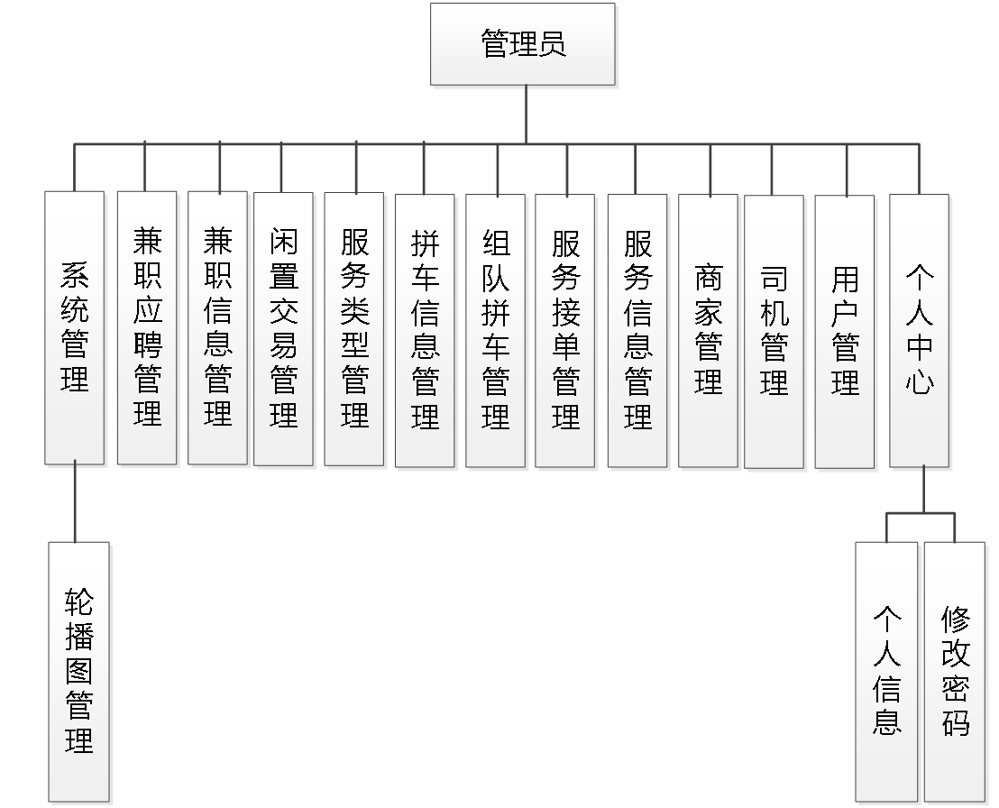
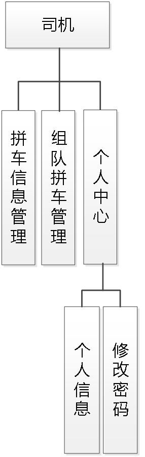
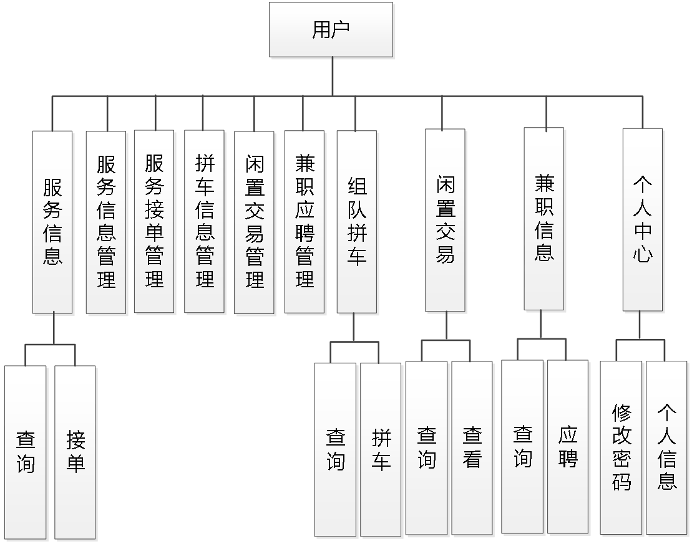
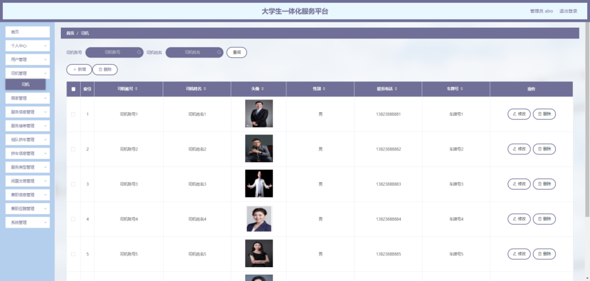
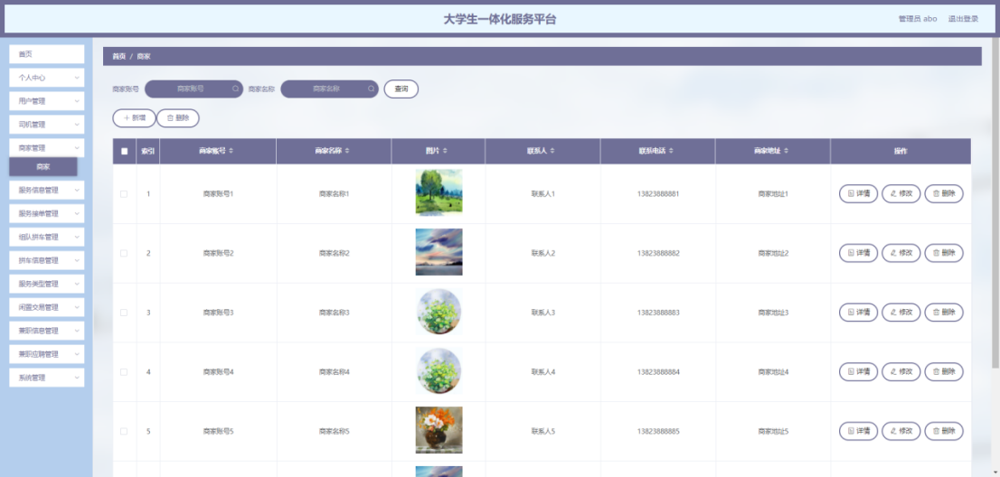
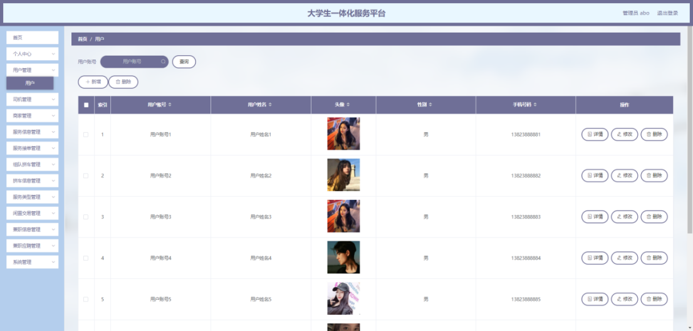
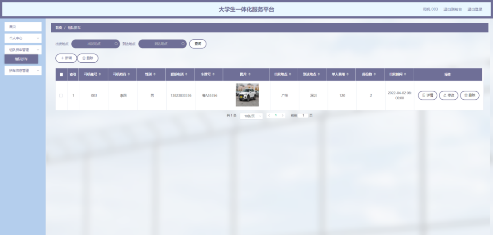
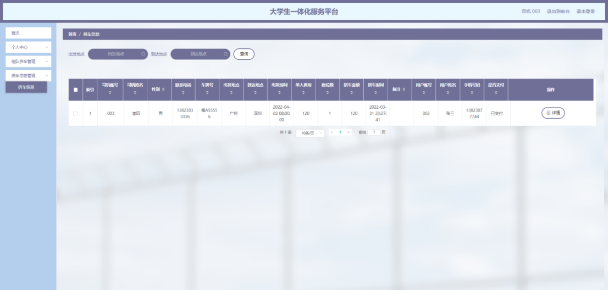
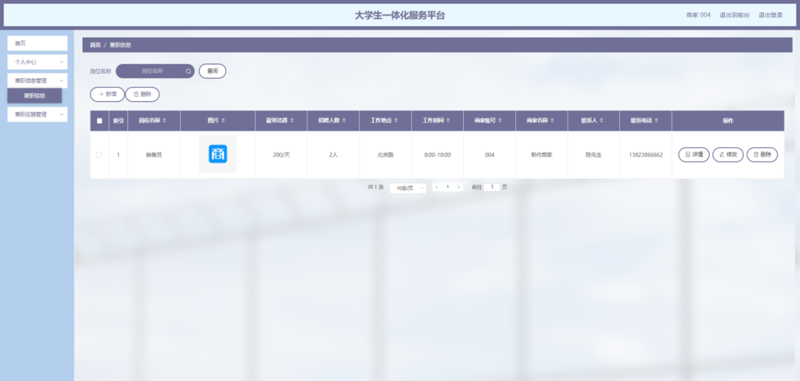
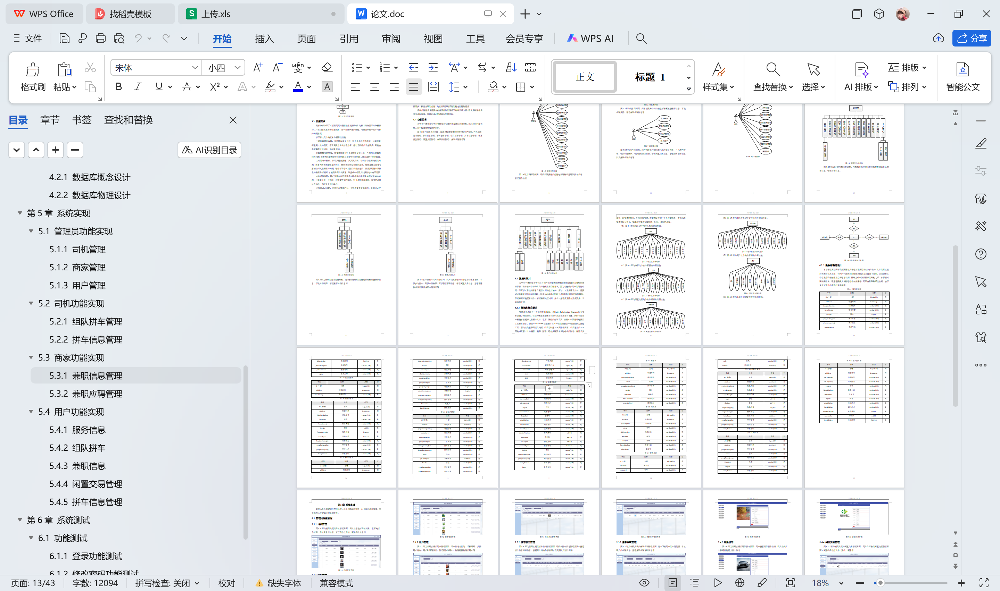

# springboot111-大学生一体化服务平台

>  博主介绍：
>  Hey，我是程序员Chaers，一个专注于计算机领域的程序员
>  十年大厂程序员全栈开发‍ 日常分享项目经验 解决技术难题与技术推荐 承接各类网站设计，小程序开发，毕设等。
>  【计算机专业课程设计，毕业设计项目，Java，微信小程序，安卓APP都可以做，不仅仅是计算机专业，其它专业都可以】

## 3000套系统可挑选，获取链接：https://chaerspol.github.io/

<b>QQ【获取完整源码】：674456564</b>

<b>QQ群【获取完整源码】：1058861570</b>

### 系统架构

> 前端：html | js | css | jquery | vue
>
> 后端：springboot | mybatis
> 
> 环境：jdk1.8+ | mysql | maven

# 一、内容包括
包括有  项目源码+项目论文+数据库源码+答辩ppt+远程调试成功

# 二、运行环境

> jdk版本：1.8 及以上； ide工具：IDEA； 数据库: mysql5.7及以上；编程语言: Java

# 三、需求分析

**3.1 可行性分析**

从三个不同的角度来分析，确保开发成功的前提是有可行性分析，只有进行提前分析，符合程序开发流程才不至于开发过程的中断。

**3.1.1 技术可行性**

在技术实现层次，分析了好几种技术实现方法，并且都有对应的成功案例，也有很多开源模块可以进行参考，所以从技术可行性分析来讲，实现大学生一体化服务平台是没有问题的。

**3.1.2 经济可行性**

对于身为学生的开发者而言，在经济资源上面可用者很少，为了开发大学生一体化服务平台，通过开发软件对硬件的要求，发现自己的电脑是完全能用来开发的，并且学校机房的配置也可以达到要求。最重要的是选择的技术都可以在网上找到不花钱的教程以及资料，因为不花钱，所以经济方面是具有可行性的。

**3.1.3 操作可行性**

大学生一体化服务平台的具体实现，本身参考人类的正常操作逻辑，把常用的操作习惯当做主要的导航实现，可以让使用者更快速的理解并且上手操作，实现符合逻辑的操作流程是操作可行性的具体体现。
以上就是从不同的角度来分析，确保了大学生一体化服务平台的正常开展。

**3.2 系统流程**

大学生一体化服务平台投入使用后，使用者如果能看到相应的流程操作图会提高程序的理解能力。
使用者在操作大学生一体化服务平台中，应该按照本系统提供的操作流程（下图即为本系统的操作流程图）进行操作，可以减少操作失误，从而节省进入大学生一体化服务平台的时间。

# 四、功能模块

下图即为设计的管理员功能结构，管理员权限操作的功能包括用户管理，司机管理，商家管理，服务信息管理，服务接单管理，组队拼车管理，拼车信息管理，服务类型管理，闲置交易管理，兼职信息管理，兼职应聘管理等。

下图即为设计的司机功能结构，司机权限操作的功能包括增删改查组队拼车信息，管理拼车信息。

下图即为设计的商家功能结构，商家权限操作的功能包括增删改查兼职信息，下载应聘简历，管理兼职应聘信息等。

下图即为设计的用户功能结构，用户权限操作的功能包括对服务接单，可以参与拼车，可以应聘兼职，可以管理服务信息，管理闲置交易信息，查看服务接单信息以及兼职应聘信息等。

# 五、效果图展示【部分效果图】

图5.1 司机管理界面【图5.1 即为编码实现的司机管理界面，司机信息包括司机姓名，联系电话，车牌号，司机账号等信息，管理员修改司机，删除司机信息等】

图5.2 商家管理界面【图5.2 即为编码实现的商家管理界面，商家信息有联系电话，商家地址，商家名称等信息，管理员修改商家，新增商家等】

图5.3 用户管理界面【图5.3 即为编码实现的用户管理界面，用户信息有性别，手机号码，头像，用户姓名，用户账号等信息，管理员修改用户，删除需要删除的用户等】

图5.4 组队拼车管理界面【图5.4 即为编码实现的组队拼车管理界面，司机录入组队拼车信息，组队拼车信息包括出发地点，单人费用，座位数，到达地点，联系电话等信息，登记有错误的组队拼车信息也能让司机进行修改，同时也能删除需要删除的组队拼车信息。】

图5.5 拼车信息管理界面【图5.5 即为编码实现的拼车信息管理界面，司机在拼车信息管理界面中查看拼车信息详细信息，查看用户姓名和手机号以及是否支付拼车订单。】

图5.6 兼职信息管理界面【图5.6 即为编码实现的兼职信息管理界面，商家登记兼职信息，兼职信息包括工作地点，工作时间，薪资待遇，岗位名称等信息，商家对兼职信息可以查询，更改等。】

 <b>完整文章</b>
 
 
 

## 3000套系统可挑选，获取链接：https://chaerspol.github.io/

<b>QQ【获取完整源码】：674456564</b>

<b>QQ群【获取完整源码】：1058861570</b>

